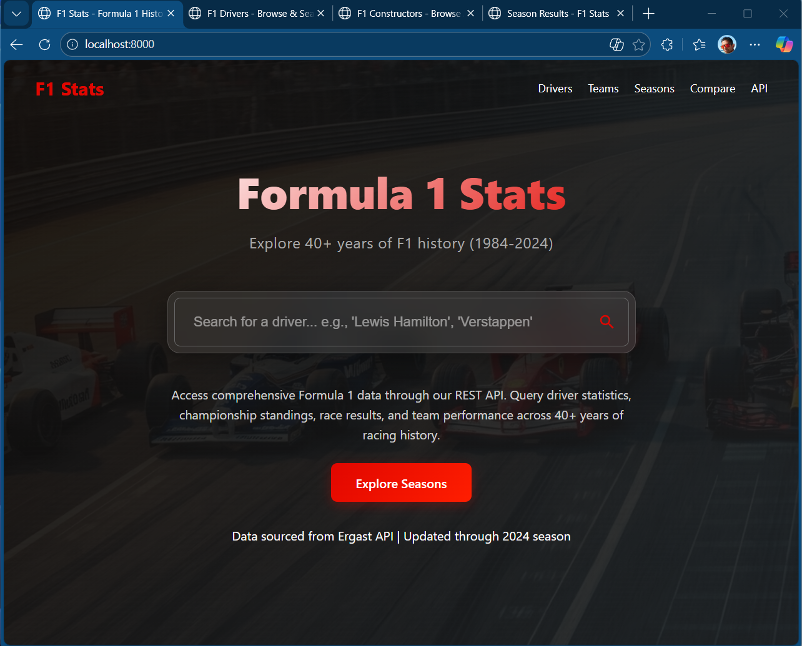
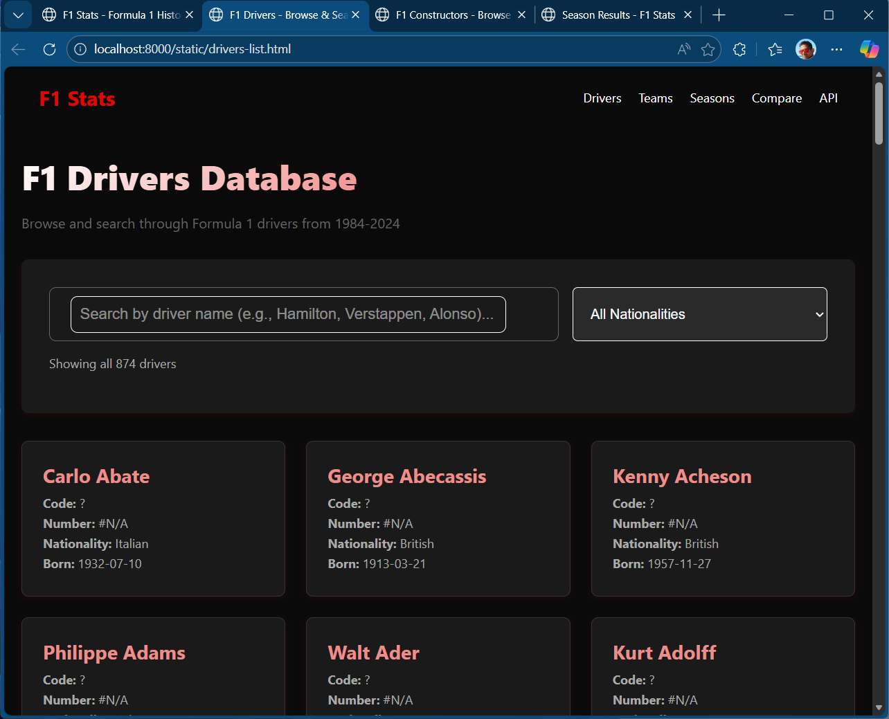
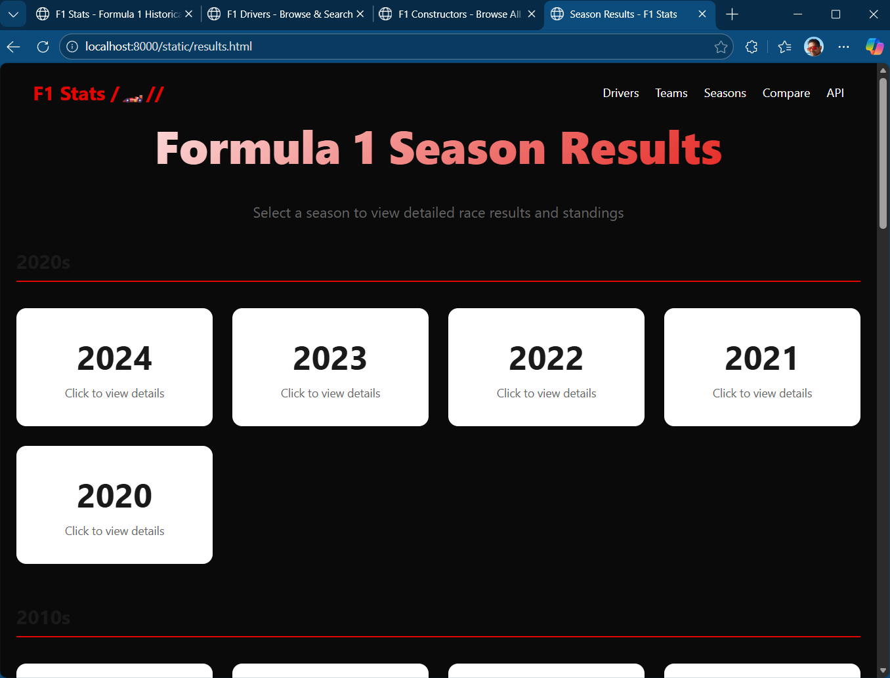

# F1 Data API 🏎️

A lightweight, localised fast REST API for querying Formula 1 historical data (1984-2024). Built with FastAPI using a **keyword-first, LLM-optional** architecture for maximum speed and reliability.

## Built with Github Speckit

This project demonstrates how the F1 Data API was built using GitHub Copilot using [Github Speckit][Github Speckit](https://github.com/github/spec-kit) and provides step-by-step instructions for setting up the project on Windows Subsystem for Linux (WSL). 

This is meant as a demo for developers learning GitHub Copilot's capabilities.

[](https://www.python.org/downloads/)
[](https://fastapi.tiangolo.com)
[](https://opensource.org/licenses/MIT)

## ✨ Features

- 🚀 **Zero Database Dependency** - All data served from JSON files with intelligent caching
- ⚡ **Blazingly Fast** - 1-5ms response times for keyword queries
- 🎯 **Keyword-First Processing** - 90%+ of queries handled without AI/LLM
- 🤖 **Optional LLM Integration** - Fallback to Ollama (local)/Azure OpenAI for complex queries
- 📊 **Comprehensive Data** - 874 drivers, 211 constructors, 40 years of F1 history (sourced from Jolpica F1 stats)
- 🌐 **Web Interface** - Simple HTML/JS chat interface, no build tools needed
- 📝 **Auto-Generated Docs** - Interactive Swagger UI at `/docs`
- 🔄 **CORS Enabled** - Ready for web frontend integration

## 🚀 Quick Start

### Prerequisites

- Python 3.12 or higher
- pip (Python package manager)
- git

### Installation

```bash
# Clone the repository
git clone https://github.com/cknzraposo/f1-app.git
cd f1-app

# Create a virtual environment
python3 -m venv venv

# Activate the virtual environment
source venv/bin/activate  # On Windows: venv\Scripts\activate

# Install dependencies
pip install -r requirements.txt
```

### Running the Application

```bash
# Activate the virtual environment (if not already active)
source venv/bin/activate

# Start the development server
uvicorn app.api_server:app --reload --host 0.0.0.0 --port 8000
```

The API will be available at:
- **API Base URL**: http://localhost:8000
- **Interactive Docs**: http://localhost:8000/docs (Swagger UI)
- **Alternative Docs**: http://localhost:8000/redoc (ReDoc)
- **Web Interface**: http://localhost:8000/static/index.html

### Quick Test

```bash
# Get all drivers
curl http://localhost:8000/api/drivers | jq

# Get driver stats
curl http://localhost:8000/api/drivers/max_verstappen/stats | jq

# Get constructor stats
curl http://localhost:8000/api/constructors/red_bull/stats | jq

# Get 2023 championship standings
curl http://localhost:8000/api/seasons/2023/standings | jq
```

## Screenshots








## 📖 Documentation

- **[API Documentation](_docs/readme.md)** - Comprehensive API endpoint reference
- **[GitHub Copilot Learning Guide](_docs/github-copilot-learning-guide.md)** - How this app was built with Copilot + WSL setup guide
- **[Architecture Deep Dive](_docs/ARCHITECTURE.md)** - System design and architecture details
- **[Keyword-First Architecture](_docs/keyword-first-architecture.md)** - Why we prioritize keywords over LLMs

## 🏗️ Architecture

This application uses a **keyword-first, LLM-optional** architecture:

```
User Query
    ↓
QueryParser (Keyword Matching) ← PRIMARY PATH (90%+)
    ↓
    Match Found?
    ├─ YES → Execute API Call → Return Result ⚡ (1-5ms)
    └─ NO → LLMService (Fallback) → Execute API Call → Return Result 🤖 (1-5s)
```

**Key Design Principles:**
1. **Speed First** - Keyword parsing returns results in 1-5ms
2. **Reliability** - No external dependencies required for core functionality
3. **Simplicity** - No database, no build process, no complex setup
4. **Flexibility** - LLM integration available but completely optional

## 📁 Project Structure

```
f1-app/
├── app/                          # Main application code
│   ├── api_server.py             # FastAPI application & core routes
│   ├── query_parser.py           # Keyword-based query handler (PRIMARY)
│   ├── llm_service.py            # LLM integration (FALLBACK)
│   ├── json_loader.py            # Data loading with LRU caching
│   └── routers/                  # API route modules
├── f1data/                       # F1 race results (1984-2024)
├── f1drivers/                    # All F1 drivers database
├── f1constructors/               # All F1 teams database
├── static/                       # Web interface
├── tests/                        # Test suite
├── _docs/                        # Documentation
└── requirements.txt              # Python dependencies
```

## 🔧 API Endpoints

### Core Endpoints

| Endpoint | Description |
|----------|-------------|
| `GET /` | API information and health check |
| `GET /health` | Simple health check |
| `GET /api/drivers` | Get all F1 drivers (874 total) |
| `GET /api/drivers/{driver_id}` | Get specific driver details |
| `GET /api/drivers/{driver_id}/stats` | Get driver statistics |
| `GET /api/constructors` | Get all constructors (211 total) |
| `GET /api/constructors/{id}` | Get specific constructor details |
| `GET /api/constructors/{id}/stats` | Get constructor statistics |
| `GET /api/seasons/{year}` | Get season data (1984-2024) |
| `GET /api/seasons/{year}/standings` | Get championship standings |
| `GET /api/seasons/{year}/winners` | Get race winners for a season |

See [API Documentation](_docs/readme.md) for complete endpoint reference.

## 🧪 Testing

```bash
# Run all tests
pytest

# Run with coverage
pytest --cov=app tests/

# Run specific test file
pytest tests/test_api.py -v
```

## 🌐 Data Source

This application uses Formula 1 data from the [Ergast Developer API](https://api.jolpi.ca/ergast/), stored locally as JSON files for optimal performance.

## 🤝 Contributing

Note: This is for demo / learning purposes ONLY. Not a supported project.
Contributions are welcome! Please feel free to submit a Pull Request. For major changes, please open an issue first to discuss what you would like to change.

1. Fork the repository
2. Create your feature branch (`git checkout -b feature/AmazingFeature`)
3. Commit your changes (`git commit -m 'Add some AmazingFeature'`)
4. Push to the branch (`git push origin feature/AmazingFeature`)
5. Open a Pull Request

## 📚 Learning Resources

This project serves as a demonstration of:
- **FastAPI** best practices
- **GitHub Copilot** usage in real-world development
- **Keyword-first architecture** for AI applications
- **Efficient caching strategies** with Python

See the [GitHub Copilot Learning Guide](_docs/github-copilot-learning-guide.md) for detailed examples and exercises.

## 📄 License

MIT License

Copyright (c) 2026 cknzraposo

Permission is hereby granted, free of charge, to any person obtaining a copy
of this software and associated documentation files (the "Software"), to deal
in the Software without restriction, including without limitation the rights
to use, copy, modify, merge, publish, distribute, sublicense, and/or sell
copies of the Software, and to permit persons to whom the Software is
furnished to do so, subject to the following conditions:

The above copyright notice and this permission notice shall be included in all
copies or substantial portions of the Software.

THE SOFTWARE IS PROVIDED "AS IS", WITHOUT WARRANTY OF ANY KIND, EXPRESS OR
IMPLIED, INCLUDING BUT NOT LIMITED TO THE WARRANTIES OF MERCHANTABILITY,
FITNESS FOR A PARTICULAR PURPOSE AND NONINFRINGEMENT. IN NO EVENT SHALL THE
AUTHORS OR COPYRIGHT HOLDERS BE LIABLE FOR ANY CLAIM, DAMAGES OR OTHER
LIABILITY, WHETHER IN AN ACTION OF CONTRACT, TORT OR OTHERWISE, ARISING FROM,
OUT OF OR IN CONNECTION WITH THE SOFTWARE OR THE USE OR OTHER DEALINGS IN THE
SOFTWARE.

## 🙏 Acknowledgments

- [Ergast Developer API](https://api.jolpi.ca/ergast/) - F1 data source
- [FastAPI](https://fastapi.tiangolo.com/) - Modern web framework
- [Tailwind CSS](https://tailwindcss.com/) - UI styling
- All F1 fans and contributors + GitHub Copilot

## 📞 Support

For questions, issues, or feature requests, please [open an issue](https://github.com/cknzraposo/f1-app/issues) on GitHub.

---

**Built with ❤️ using FastAPI and GitHub Copilot**
